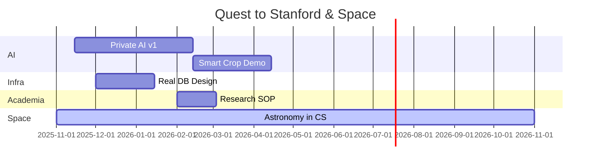

<!-- Animated Header -->

 

 

---

## 🔭 **What I'm Building**

<table>
<tr>
<td width="50%">

</td>
<td width="50%">

</td>
</tr>
<tr>
<td width="50%">

</td>
<td width="50%">

</td>
</tr>
</table>

---

## 🛠 **Tech Stack**

  

---

## 🚀 **Experience**

| Role | Organization | Duration |
|------|-------------|----------|
| 💻 **SWE Fellow** | **Headstarter AI** | Jul–Aug 2024 |
| 🏗️ **Builder** | **buildspace** | Jun–Aug 2024 |
| 🚀 **Citizen Scientist** | **NASA** | 2024–2025 |

---

## 🎯 **Roadmap (Next 12 Months)**

### 🗓️ Milestones

| Phase | Focus | Timeline |
|-------|-------|----------|
| 🤖 **AI** | Private AI v1 → Smart Crop Demo | 90 + 60 days |
| ⚙️ **Infra** | Real DB Design | 45 days |
| 📚 **Academia** | Research SOP | 30 days |
| 🌌 **Space** | Astronomy in CS | 365 days (Active) |

---

## 📊 **GitHub Stats**

---

## 📬 **Let's Connect**

---

**💡 "Building AI that respects privacy, helping farmers, and exploring the cosmos"**

*Last updated: November 2025*

